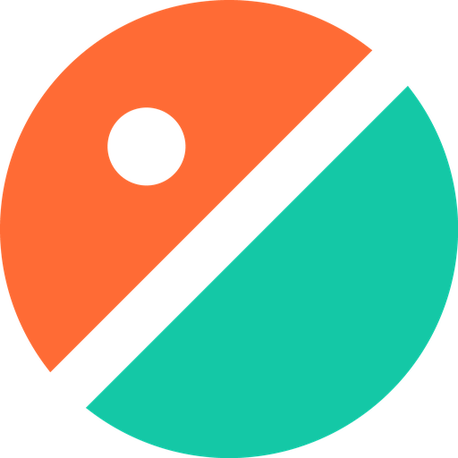
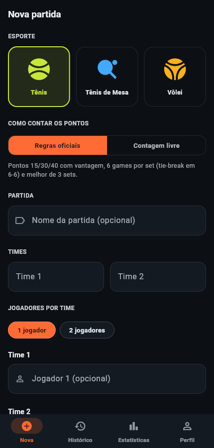
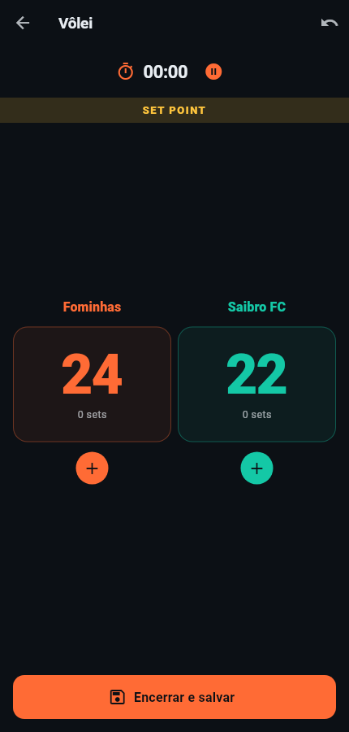
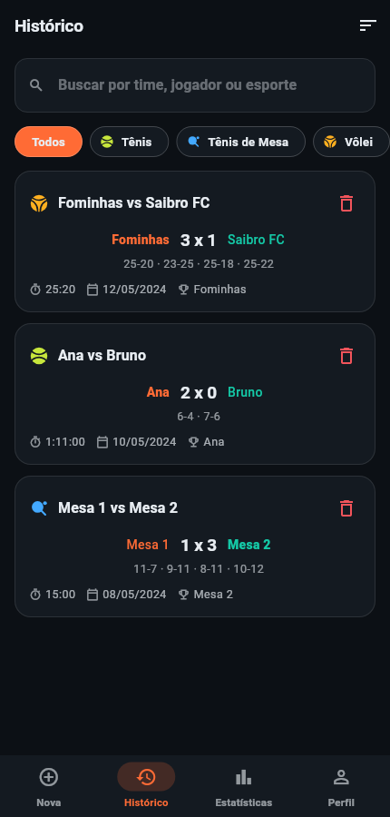

<p align="center">
  
</p>

<h1 align="center">MatchMaster</h1>

<p align="center">
  <strong>Placar e histórico das suas partidas de Tênis, Tênis de Mesa e Vôlei.</strong>
</p>

<p align="center">
  
  
  
  
</p>

<p align="center">
  
  
  
</p>

---

## O que é

O **MatchMaster** é um app Flutter para marcar ponto e guardar o resultado das
partidas que você joga com os amigos. Você monta a partida (esporte, times,
jogadores), marca os pontos durante o jogo e o resultado fica salvo no aparelho
para consultar depois.

Tudo é **local**: não há servidor, cadastro nem envio de dados para lugar
nenhum. O histórico vive no SQLite do próprio aparelho.

## Funcionalidades

### Placar que entende o esporte

Em **Regras oficiais**, o app conta os pontos como o esporte manda:

| Esporte | Pontuação | Set / Game | Partida |
| --- | --- | --- | --- |
| Tênis | 15 / 30 / 40, deuce e vantagem | 6 games com 2 de diferença; tie-break de 7 pontos em 6-6 | melhor de 3 sets |
| Tênis de Mesa | pontos corridos até 11, com 2 de diferença | — | melhor de 5 games |
| Vôlei | pontos corridos até 25, com 2 de diferença | quinto set em 15 pontos | melhor de 5 sets |

O app avisa quando o próximo ponto é **set point** ou **match point**, e encerra
a partida sozinho quando ela acaba.

Prefere só contar pontos, sem regra nenhuma? O modo **Contagem livre** mantém o
comportamento simples: os pontos sobem, você encerra quando quiser.

### Durante a partida

- Toque em qualquer lugar do placar do time para marcar ponto.
- **Desfazer** o último ponto quantas vezes precisar.
- Cronômetro com **pausa e retomada**.
- Placar set a set na tela.
- Confirmação antes de descartar uma partida em andamento.

### Depois da partida

- **Histórico** com busca por time, jogador ou esporte, filtro por esporte e
  ordenação por data ou duração.
- **Detalhes** de cada partida com o placar de cada set e um resumo pronto para
  copiar e colar em qualquer conversa.
- Exclusão com confirmação e **desfazer**.
- **Estatísticas**: total de partidas, tempo em quadra, duração média,
  distribuição por esporte e classificação dos times por vitórias e
  aproveitamento.
- **Perfil** com nome editável e tema claro, escuro ou o do sistema.

## Identidade visual

A marca parte da própria ideia do app: **dois lados disputando**. O emblema é
uma bola cortada pela diagonal da rede, e as duas cores voltam no placar — cada
time tem a sua, para dar para ler quem está na frente sem procurar o nome.

| | Cor | Uso |
| --- | --- | --- |
| 🟠 | `#FF6B35` clay | Primária, time 1 |
| 🟢 | `#14C8A6` teal | Secundária, time 2 |
| 🟡 | `#FFC53D` amber | Conquista: vencedor, líder, match point |
| ⚫ | `#0C1015` ink | Base do tema escuro |

Cada esporte tem o seu acento — verde-limão no tênis, azul no tênis de mesa,
âmbar no vôlei.

O emblema e as ilustrações dos esportes são **desenhados em vetor no Flutter**
(`lib/widgets/brand.dart` e `lib/widgets/sport_glyph.dart`), então ficam nítidos
em qualquer tamanho, acompanham o tema claro/escuro e o app não carrega nenhum
bitmap em tempo de execução.

Os ícones de todas as plataformas saem do mesmo desenho:

```bash
pip install Pillow
python3 tool/generate_icons.py
```

## Como rodar

Requer o [Flutter](https://docs.flutter.dev/get-started/install) 3.24 ou
superior.

```bash
flutter pub get
flutter run
```

### Testes e análise

```bash
flutter analyze                                   # análise estática
dart format --output=none --set-exit-if-changed lib test
flutter test                                      # 66 testes
```

Os mesmos comandos rodam no CI a cada push (`.github/workflows/ci.yml`).

As capturas deste README são geradas pelo app de verdade:

```bash
flutter test test/preview/screens_preview.dart test/preview/brand_preview.dart --update-goldens
```

Esses arquivos ficam fora do padrão `*_test.dart` de propósito: comparação de
pixels depende da máquina que renderiza e quebraria o CI.

## Estrutura do projeto

```
lib/
  core/theme/       identidade visual (Material 3, preto e amarelo)
  core/utils/       formatação de duração, data e iniciais
  models/           Sport (regras de cada esporte) e MatchRecord
  scoring/          motor de pontuação: estado imutável + regras por esporte
  data/             banco SQLite, migrações, repositório e preferências
  screens/          login, casca com abas, nova partida, placar,
                    histórico, detalhes, estatísticas e perfil
  widgets/          marca, ilustrações dos esportes e componentes comuns
test/
  core/ models/ scoring/   testes unitários das regras
  data/                    repositório e migração do banco antigo
  screens/                 testes de widget dos fluxos principais
  preview/                 gera as capturas de docs/screenshots
tool/
  generate_icons.py        ícones de todas as plataformas
```

O motor de pontuação é **puro**: cada ponto devolve um novo estado imutável em
vez de alterar o anterior. É o que torna o desfazer confiável e as regras
testáveis sem subir nenhuma tela.

## Plataformas

Android, iOS, Windows, macOS e Linux. A versão **web não é suportada**: o
armazenamento local usa `sqflite`, que não roda no navegador — o app exibe um
erro claro em vez de falhar silenciosamente.

## Atualizando de uma versão anterior

O banco é migrado automaticamente na primeira abertura, convertendo a duração,
os jogadores e o vencedor de cada partida já registrada.

⚠️ O identificador do app mudou de `com.example.matchmaster` (o valor do
template, que nenhuma loja aceita) para `com.rigoandre.matchmaster`. Para o
sistema operacional isso é **outro app**: quem tinha a versão anterior instalada
não recebe esta como atualização, e o histórico antigo continua com a instalação
anterior.

## Licença

MIT — veja [LICENSE](LICENSE).
